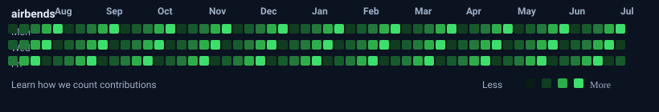

<div align="center">

<h3><code>airbends@github ~ $ whoami</code></h3>

<table>
<tr>
<td valign="top">

</td>
<td valign="top">

</td>
</tr>
</table>

<br><br>

<h3><code>airbends@github ~ $ ./contributions.sh</code></h3>



<br><br>

<h3><code>airbends@github ~ $ cat about.txt</code></h3>

```bash
> Name        : Irfan
> Username    : airbends
> Role        : Full Stack Developer
> Focus       : Web Development • AI • Open Source
> Languages   : Python • JavaScript • Java
> Frontend    : React • HTML • CSS • Tailwind CSS
> Backend     : Node.js • Django • Express
> Database    : MySQL
> Tools       : Git • GitHub • VS Code
> Learning    : System Design • DevOps • AI
> Status      : Building projects and learning every day.
```

<br>

<h3><code>airbends@github ~ $ ./tech-stack.sh</code></h3>

<p>


</p>

<br>

<h3><code>airbends@github ~ $ ./connect.sh</code></h3>

[](https://github.com/airbends)

<!-- Replace these with your own links -->

[](#)

[](#)

[](#)

</div>
